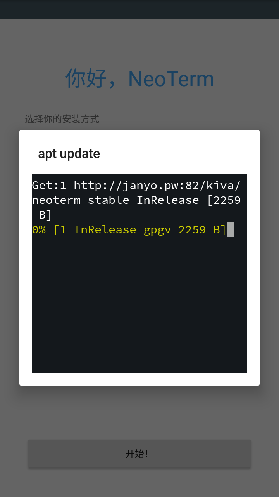
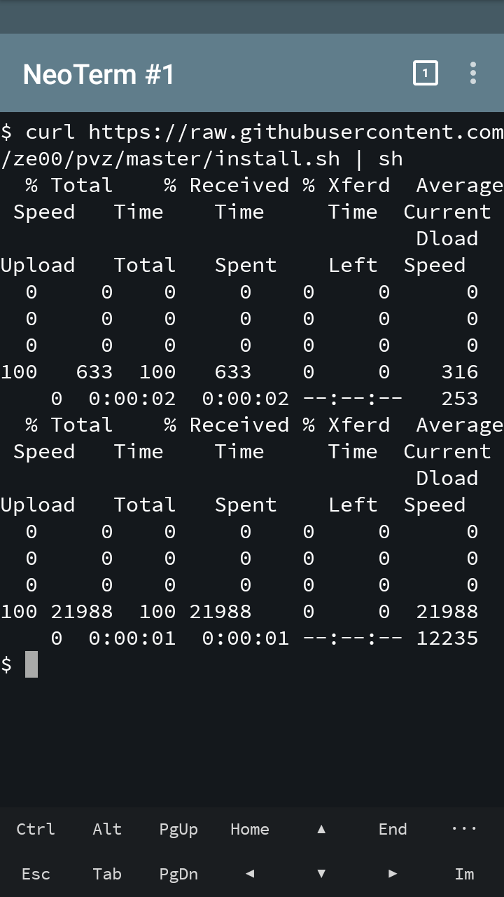
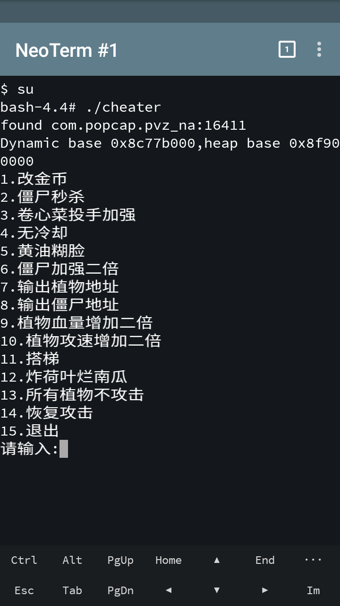
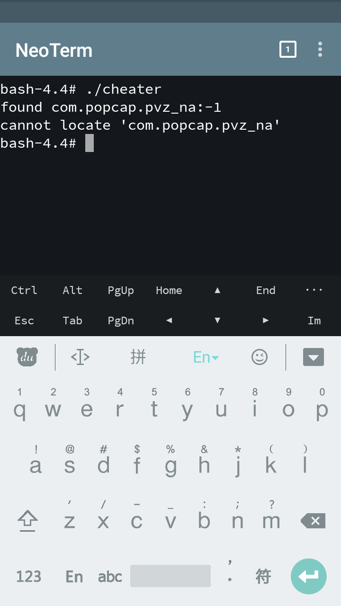

# PVZ小工具
  * 本人仅在6.0.1与7.11的Android(32位)系统上测试过北美版的pvz
    
  * 效果
    
  * 需要Root权限
## 使用步骤
  * **获取一个北美版的植物大战僵尸**

    目前可能必须要使用我提供的pvz主程序，否则不保证功能能够正常使用

    本人所使用的北美版:链接: https://pan.baidu.com/s/1d1T0K2 密码: y98i

    本文档第一张图即是详细的版本信息，感谢植物大战僵尸吧@囧丫乙

    具体安装教程:http://lonelystar.org/ResDownload/1_Android_Na.htm

  * 1.**使用直装版的修改器**

    链接: https://pan.baidu.com/s/1kWUH3Kj 密码: 4hby

    基于NeoTerm(https://github.com/NeoTerm/NeoTerm)

    感谢@imkiva
  * 2.**使用面向Linux高手的修改器**
  * 安装NeoTerm
    https://www.coolapk.com/apk/io.neoterm

    安装完之后第一次打开将会下载几mb的东西，安装即可
    
    
  * 获取修改器程序

    打开你安装的NeoTerm

    然后输入:
    ```
    apt install curl
    curl https://raw.githubusercontent.com/ze00/pvz/master/install.sh | sh
    ```
    
    
  * 运行修改器程序

    在NeoTerm内输入:
    ```
    su
    ```
    如果您已获取Root权限，则您的Root权限管理器会提示是否允许'NeoTerm使用Root权限'，点击允许即可

    与此同时，NeoTerm也将会变成类似于下图这样的提示
    

    在NeoTerm内输入:
    ```
    ./cheater
    ```
    如果您已经启动了植物大战僵尸，则应该是
    
    否则，将会是
    
## 如何获取更新的修改器程序
  * 很简单，只需要在NeoTerm下执行:
    ```
    apt install curl
    curl https://raw.githubusercontent.com/ze00/pvz/master/install.sh | sh
    ```
    
    
REF:https://github.com/scanmem/scanmem
