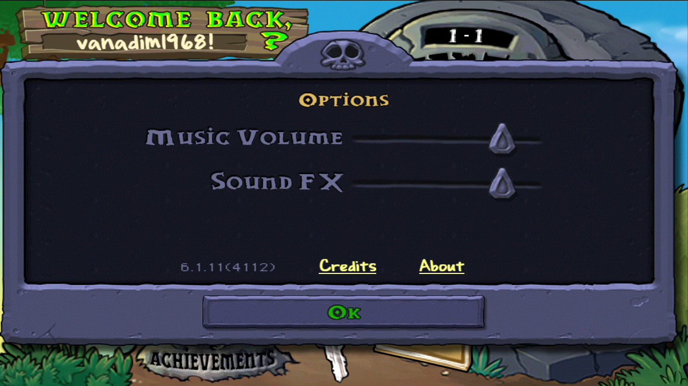
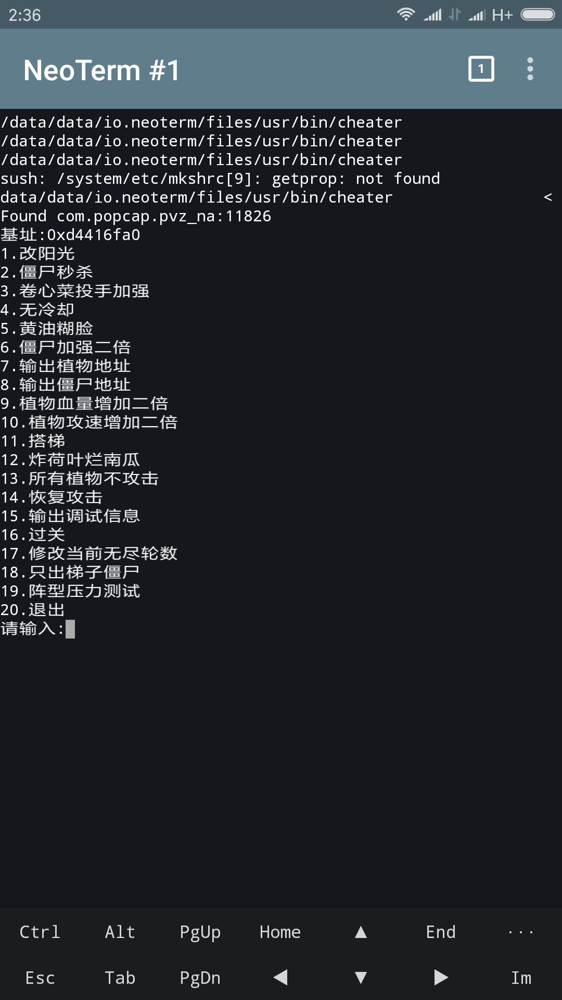

# PVZ小工具
  * 本人在aarch64/arm的Android 7.12中测试通过
    
  * 效果
    
  * 需要Root权限
## 使用步骤
  * **获取一个北美版的植物大战僵尸**

    目前必须要使用我提供的pvz主程序，否则不保证功能能够正常使用

    本人所使用的北美版:链接: https://pan.baidu.com/s/1d1T0K2 密码: y98i

    本文档第一张图即是详细的版本信息，感谢植物大战僵尸吧@囧丫乙

    具体安装教程:http://lonelystar.org/ResDownload/1_Android_Na.htm

  * 1.**使用直装版的修改器**

    链接: https://pan.baidu.com/s/1kWUH3Kj 密码: 4hby

    基于NeoTerm(https://github.com/NeoTerm/NeoTerm)

    感谢@imkiva

    打开修改器，会请求您给予ROOT权限，允许即可

    如果您已经启动了植物大战僵尸，则应该是
    
    否则，将会是
    

REF:https://github.com/scanmem/scanmem
